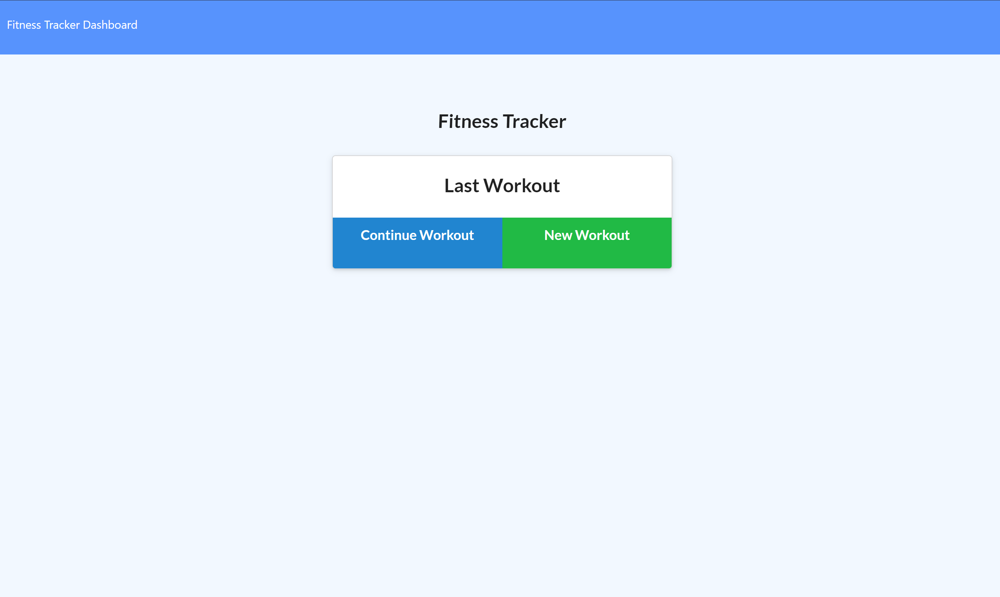

# workout-tracker

## DESCRIPTION

USER STORY:
As a user, I want to be able to view create and track daily workouts. I want to be able to log multiple exercises in a workout on a given day. I should also be able to track the name, type, weight, sets, reps, and duration of exercise. If the exercise is a cardio exercise, I should be able to track my distance traveled.

This app allows the user to track their workout routine. If you need to edit a workout you already made, or delete one you prerecorded but ended up not doing? No problem! You can do that here no problem!

## TABLE OF CONTENTS

\*[Installation](#Installation)

\*[Usage](#Usage)

\*[License](#License)

\*[Contributing](#Contributing)

\*[Tests](#Tests)

\*[Questions](#Questions)

## LAYOUT

Here's what the application looks like!

Deployed site:

Heroku site:
https://track-my-workout-now.herokuapp.com/

GitHub:
https://github.com/jamjon94/workout-tracker

## LICENSE

This application is licensed under the MIT license.

Find out more about the license here:

(https://opensource.org/licenses/MIT)

## CONTRIBUTING

This application was completed with a little help from a few fellow students in Boot Camp who answer my questions when I had them.

## QUESTIONS

For any questions, contact me:

Github: https://www.github.com/jamjon94

email: jamie.mar.jones14@gmail.com
